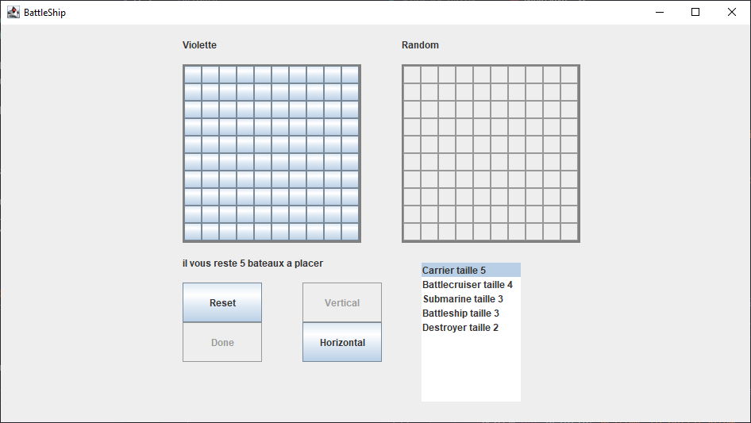

# Battleship
> Un jeu de bataille navale utilisable dans une fenêtre

## Table des matières
- [Battleship](#battleship)
  - [Table des matières](#table-des-matières)
  - [Présentation](#présentation)
  - [Fonctionnalités](#fonctionnalités)
  - [Captures](#captures)
  - [Manuel](#manuel)
  - [Statut](#statut)
  - [Contact](#contact)


## Présentation
> Fait dans le cadre d'un projet d'université, BattleShip permet à l'utilisateur de faire une partie de Bataille Navale dans le terminal ou sur une interface graphique

Le concept de la Bataille Navale est bien connu de tous, deux joueurs s'affrontent en menant
une flotte de bateaux et en tirant une fois par tour dans la flotte ennemie. 

Le but de ce projet était d'implément une bataille navale jouable avec un ordinateur jouant
aléatoirement ou un joueur humain. Le projet devait pleinement suivre le principe de MVC.

## Fonctionnalités
La liste de fonctionnalités de BattleShip est la suivante :
- Implémenter une bataille navale fonctionnelle en mode terminal et dans une interface graphique
- Avoir un joueur ordinateur capable de jouer (au hasard)
- Permettre au joueur de placer ses bateaux
- Permettre une partie entre deux joueur humains


## Captures

<!-- If you have screenshots you'd like to share, include them here. -->


## Manuel
Pour lancer le programme depuis Windows, double-cliquer sur le fichier start.bat se trouvant à la racine

Sinon, pour lancer depuis une invite de commandes, utiliser :
```sh
java -jar dist/BattleShip.jar
```
Les étapes à suivre seront indiquées dans le terminal.

## Statut
Le projet est terminé et n'est plus mis à jour.

## Contact
Le projet fut réalisé par l'équipe suivante :
- Violette Dev [@VioletteDev](https://github.com/VioletteDev)
- Kawax [@K4w4x](https://github.com/K4w4x)
- EdoudZz [@EdoudZz](https://github.com/EdoudZz)
- NMW-Dev [@NMW-Dev](https://github.com/NMW-Dev)
